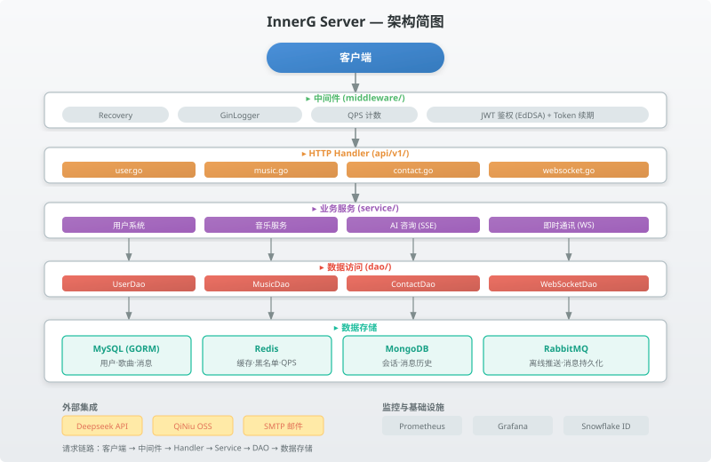

# InnerG Server
- 本项项目是基于前后端分离架构的实践，前端项目：[InnerG-web](https://github.com/1341292919/InnerG-web)

InnerG 的后端服务，基于 Go + Gin，提供以下核心能力：
- 用户系统（邮箱验证码、注册、登录、资料维护、头像上传）
- AI 咨询会话（会话管理 + 流式对话 SSE）
- 音乐服务（歌单与歌曲查询）
- 即时通讯（WebSocket 在线聊天 + RabbitMQ 离线推送）
---



*完整架构图见 [doc/image/architecture.svg](doc/image/architecture.svg)*

---

## 1. 技术栈

- Go `1.25.0`
- Web 框架：`gin-gonic/gin`
- ORM：`gorm` + `dbresolver`（读写分离）
- MySQL 驱动：`gorm.io/driver/mysql`
- Redis：`redis/go-redis/v9`
- MongoDB：`mongo-driver/v2`
- 消息队列：`wagslane/go-rabbitmq`
- 鉴权：`golang-jwt/jwt/v4`（EdDSA Ed25519）
- 配置：`spf13/viper`（热更新）
- WebSocket：`gorilla/websocket`
- 文件存储：`qiniu/go-sdk/v7`
- 监控：`prometheus/client_golang` + Grafana
- 邮件：`jordan-wright/email`
- ID 生成：Snowflake

---

## 2. 项目结构

```text
cmd/                # 程序入口
api/v1/             # HTTP Handler（user/music/contact/websocket）
routes/             # 路由注册与中间件
service/            # 业务逻辑层
  └─ websocket/     #   即时通讯（连接管理、消息路由、消费端）
dao/                # 数据访问层
  ├─ db/            #   MySQL (GORM)
  ├─ cache/         #   Redis
  ├─ mongo/         #   MongoDB
  └─ rabbitmq/      #   RabbitMQ（生产/消费）
middleware/metrics/ # QPS 监控中间件
config/             # 配置与初始化脚本（sql/mongodb/prometheus）
pkg/                # 公共组件
  ├─ constants/     #   常量定义
  ├─ errno/         #   错误码
  ├─ jwt/           #   鉴权中间件
  ├─ logger/        #   日志（每日轮转）
  ├─ oss/           #   对象存储
  ├─ utils/         #   工具（Deepseek API、SMTP、Snowflake）
  └─ ctl/           #   上下文用户信息提取
pack/               # 响应构建器
types/              # 请求/响应结构体
docker/             # 本地开发环境编排
docs/               # 文档
```

请求链路：`Client → Middleware → Handler → Service → DAO → Data Store`。

---

## 3. 本地运行

### 3.1 前置条件

- Go `>= 1.25`
- Docker + Docker Compose
- Linux/macOS 环境（Makefile 使用了 `sudo chown`）

### 3.2 启动依赖服务

```bash
make env-up
```

该命令通过 Docker Compose 启动 7 个服务：

| 服务 | 端口 | 说明 |
|------|------|------|
| MySQL | `3306` | 用户/歌曲/消息表 |
| Redis | `6379` | 缓存/黑名单/QPS |
| MongoDB | `27017` | AI 会话与消息 |
| RabbitMQ | `5672`/`15672` | 消息队列 |
| Prometheus | `9090` | 指标采集 |
| Grafana | `3000` | 可视化仪表盘 |

挂载初始化脚本：
- MySQL：`config/sql/init.sql`
- MongoDB：`config/mongodb/init.js`
- Prometheus：`config/prometheus/prometheus.yml`

### 3.3 启动服务

```bash
go run ./cmd/main.go
```

默认监听地址来自 `config/config.yaml`

### 3.4 停止环境

```bash
make env-down
```

---

## 4. 配置说明

配置文件路径：`config/config.yaml`

### 4.1 关键配置项

- `service.address`：服务监听地址
- `service.private-key`：JWT 私钥（Ed25519 PEM）
- `mysql.*`：MySQL 连接信息
- `redis.*`：Redis 连接信息
- `mongodb.*`：MongoDB 连接信息
- `rabbitmq.*`：RabbitMQ 连接信息
- `api.*`：大模型接口配置（URL、Key、Model）
- `smtp.*`：验证码邮件发送配置
- `oss.*`：对象存储配置（头像上传）
- `log.*`：业务日志/Gin 日志路径与前缀

### 4.2 配置热更新

通过 `viper.WatchConfig()` 监听配置变更，修改 `config/config.yaml` 后自动生效。

---

## 5. 数据存储

| 存储 | 用途 | ORM/驱动 |
|------|------|----------|
| MySQL | 用户、歌曲、歌单、消息 | GORM + dbresolver（读写分离） |
| Redis | 验证码、token 黑名单、音乐缓存、QPS 计数、离线消息 | go-redis |
| MongoDB | AI 会话与消息历史（嵌套文档） | mongo-driver |
| RabbitMQ | WebSocket 离线推送与消息持久化解耦 | go-rabbitmq |

---

## 6. 即时通讯（WebSocket）

- **连接管理**：`gorilla/websocket` 升级 HTTP 连接，`manager/` 维护内存映射 `userId → *UserConnection`
- **心跳保活**：10s ping / 30s pong timeout
- **消息路由**：在线消息直接 WebSocket 推送；离线消息写入 Redis（`SAdd`），下次上线推送
- **消息持久化**：所有消息通过 RabbitMQ `store` 队列异步写入 MySQL
- **历史消息**：`GET /ws/messages` 分页查询；`GET /ws/unread` 查询未读数

---

## 7. AI 咨询（SSE 流式对话）

- 会话管理：创建/列表/详情/软删除，MongoDB 存储
- 流式对话：HTTP POST → Deepseek API（`stream=true`），逐 chunk 解析 SSE 并 `Flush()` 到客户端
- 标题提取：首轮对话自动截取标题（标记 `ㄓ`），异步更新

---

## 8. 日志

默认日志目录：`./logs`

- 业务日志前缀：`service`
- Gin 访问日志前缀：`gin`

每日 00:00 自动轮转，保留最近 30 天。

---

## 9. 监控

- **QPS 计数**：Redis 秒级计数器，Gin 中间件自动递增
- **Prometheus**：`/metrics` 端点暴露 `gin_qps_current`（实时 QPS）和 `gin_qps_sum_5min`（5 分钟累计）
- **Grafana**：预置仪表盘配置见 `docs/grafana.md`，4 面板（实时曲线、累计曲线、统计卡片）
